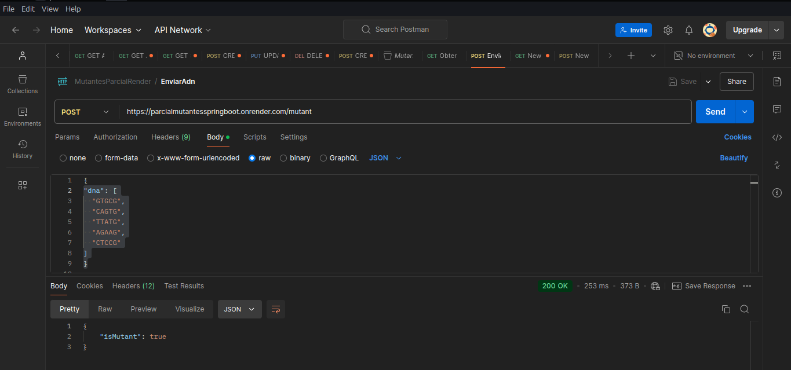

# Parcial Mutantes Desarrollo

Este parcial corresponde al parcial de back end de desarrollo de software de la UTN

Proyecto creado en:
* java con SpringBoot
+ Base de datos H2
+ Deployado en render
#### Podemos consultar si un `adn`es o no `mutante` haciendo un POST en postman al siguiente link:

nota: si ya existe un adn en nuestra base de datos este no se vuelve a contar

+ https://parcialmutantesspringboot.onrender.com/mutant

+ configuracion en postman


ejemplos de cadenas de adn humanas
```JSON
{
"dna": [
"GTGCG",
"CAGTG",
"TTATG",
"AGAAG",
"CTCCT"
]
}
```
ejemplos de cadenas de adn mutantes
```json
"dna": [
"GTGCG",
"CAGTG",
"TTATG",
"AGAAG",
"CTCCG"
]
}
```

#### podemos obtener los `stats` de `adn` de las siguientes maneras

+ ingresando un `GET` en `Postman` a la siguiente url:

https://parcialmutantesspringboot.onrender.com/stats

+ Utilizando `curl` en `linux`

```bash
curl -X GET https://parcialmutantesspringboot.onrender.com/stats
```

#### Ejemplos en postman




![[Pasted image 20241128032327.png]]
#### Ejemplos en curl
![[Pasted image 20241128032526.png]]
